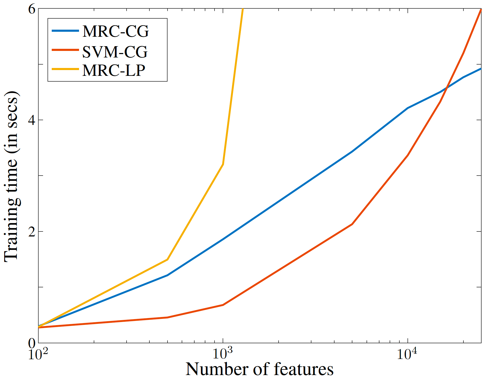
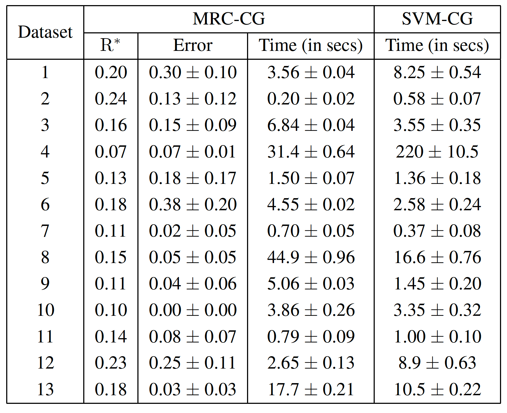

# Efficient Learning of Minimax Risk Classifiers in High Dimensions
 [](#support-and-authors)

This repository is the official implementation of [Efficient Learning of Minimax Risk Classifiers in High Dimensions](http://arxiv.org/abs/2306.06649). 

The algorithm proposed in the paper provides efficient learning for 0-1 minimax risk classifiers (MRCs) in high dimensions based on constraint generation. In particular, the iterative algorithm utilizes greedy feature selection to obtain a sequence of MRCs with decreasing worst-case error probability. Such performance assessment at learning provides a trade-off between training time and approximation error.

### Decreasing worst-case errors


### Scalability



### Worst-case errors and training times using multiple high-dimensional datasets



## Requirements

The standard libraries required are listed in the file `requirements.txt`. To install these libraries using

1) `pip`
```setup
pip install -r requirements.txt
```

2) `conda` environment
```
conda create --name <environment_name> --file requirements.txt
```

The code also requires the MRCpy library which can be installed from [this](https://github.com/MachineLearningBCAM/MRCpy) repository. In addition, the implementation of the proposed algorithm utilizes the GUROBI optimizer for which license can be downloaded from [here](https://www.gurobi.com/academia/academic-program-and-licenses/).

## Data

The repository contains multiple high-dimensional biological datasets to perform experiments as follows - 

Dataset | Variables | Samples | Classes
--- | --- | --- | --- 
Arcene | 10000 | 200 | 2 
Colon | 2000 | 62 | 2
CLL_SUB_111 | 11340 | 111 | 3
Dorothea | 100000 | 1150 | 2
GLI_85 | 22283 | 85 | 2
GLIOMA | 4434 | 50 | 4
Leukemia | 7129 | 72 | 3
Lung | 12600 | 203 | 5
MLL | 12582 | 72 | 3
Ovarian | 15154 | 253 | 2
Prostate_GE | 5966 | 102 | 2
SMK_CAN_187 | 19993 | 187 | 2
TOX_171 | 5748 | 171 | 4

The datasets are available as zip files in this repository in the `Datasets` folder with functions to easily load them an numpy matrices in `load.py`.

## Evaluation

To reproduce the results in the paper, use the following python scripts:

* param_eps.py : Experiments to study the influence of epsilon parameter and show the monotonic decrease in the worst-case error probability.
* param_n_max.py : Experiment to analyze the effect of the parameter n_max and show improved efficiency over MRC-LP.
* scalability.py : Experiments to show the scalability of the different algorithms with increasing number of features.
* comparison.py : Experiments to compare our method with the state of the art techniques in terms of error and training time.
* feature_selection.py : Experiment to compare our method as feature selection approach. The experiment is performed for binary classification datasets.

The implementation of the proposed algorithm along with the LP formulation of MRCs can be found in `Main` folder. The code for the SVM-CG can be found in `Libraries` folder which is forked from [this](https://github.com/wanghaoyue123/Column-and-constraint-generation-for-L1-SVM-and-cousins) respository.

To reproduce any of the experimental results for any dataset, run the following command - 

```
python <scriptname> <dataset>
```

The result corresponding to that experiment and dataset will be saved in the `Results/` folder in the respective folder of the experiment and the dataset.
For instance, the experiment for comparing the scalability of different algorithms for the `Ovarian` dataset can be performed as follows - 

```
python3 scalability.py Ovarian
```

and the corresponding results will be saved in `Results/Scalability/Ovarian/` as CSV.

## Usage

The proposed algorithm is also implemented in the MRCpy library which can be installed from [here](https://github.com/MachineLearningBCAM/MRCpy). After the installation, one can use the proposed algorithm through the library as follows 

```
from MRCpy import MRC

# fitting
mrc_classif = MRC(loss = '0-1, solver = 'cg', n_max = 100, k_max = 20, eps = 1e-4)
mrc_classif.fit(X,y)

# prediction
predicted_labels = mrc_classif.predict(X)
```

For further details, please check out the documentation of the library in [here](https://machinelearningbcam.github.io/MRCpy/)

## Support and Authors

Kartheek Reddy Bondugula

kbondugula@bcamath.org

Santiago Mazuelas 

smazuelas@bcamath.org

Aritz Pérez

aperez@bcamath.org

## Citation

If you find useful the code in your research, please include explicit mention of our work in your publication with the following corresponding entry in your bibliography:

[1] K. Bondugula, S. Mazuelas, A. Pérez "Efficient Learning of Minimax Risk Classifiers in High Dimensions." The 39th Conference on Uncertainty in Artificial Intelligence. PMLR, 2023.

The corresponding BiBTeX citation is given below:

@InProceedings{BonMazPer23, title = {Efficient Learning of Minimax Risk Classifiers in High Dimensions}, author = {Bondugula, Kartheek and Mazuelas, Santiago and P\'{e}rez, Aritz}, booktitle = {The 39th Conference on Uncertainty in Artificial Intelligence}, pages = {206--215}, year = {2023}, volume = {216}, series = {Proceedings of Machine Learning Research}, publisher = {PMLR}}

